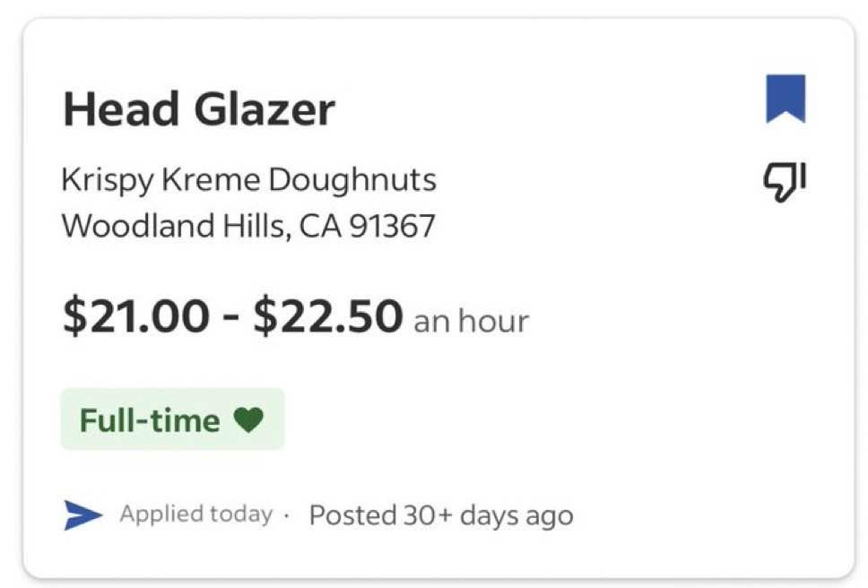

# 🥳🍩🗓️ Glaze Day Scheduler (CLI)



This you? If so, you might find this tool useful.

A Python-based scheduling application that helps manage and optimize glaze day schedules while considering birthday distances and fairness metrics.

This was a quick draft of an idea - I plan on porting most of this functionality a proper website (I already bought the [www.glaze.day](www.glaze.day) domain). The new codebase will likely be React (TypeScript), with most of the basic functionality running on the client side.

## Overview

The Glaze Day Scheduler is designed to create and manage schedules for glazing activities, with special consideration for:

- Birthday buffer periods
- Fair distribution of scheduling slots
- Interval management between glazes
- Schedule patching capabilities for roster changes

## Features

- **Schedule Generation**: Create new schedules with customizable parameters
- **Schedule Patching**: Modify existing schedules when friends join or leave
- **Fairness Metrics**: Compute and track fairness metrics for schedule distribution
- **Birthday Distance Optimization**: Maximize the distance between birthdays in the schedule
- **Customizable Parameters**:
  - Birthday buffer days
  - Interval between glazes
  - Number of cycles
  - Start date

## Project Structure

```plaintext
glaze_day_scheduler_cli/
├── main.py              # Main application entry point
├── scheduler.py         # Core scheduling algorithms
├── friends.py           # Friend data management
├── storage.py           # Schedule storage and retrieval
├── metrics.py           # Fairness metrics computation
├── utils.py             # Utility functions
├── data/                # Data directory
├── output/              # Output directory for schedules and metrics
└── prompts/             # Prompt templates
```

## Usage

1. **Basic Usage**:

   ```bash
   python -m glaze_day_scheduler_cli.main [path_to_friends_csv]
   ```

2. **Interactive Options**:
   - Generate new schedule
   - Patch existing schedule (for friend departure)
   - Patch existing schedule (for new friend addition)

3. **Configuration Parameters**:
   - Birthday buffer (days)
   - Interval between glazes (days)
   - Number of cycles
   - Start date

## Input Format

The application expects a CSV file with friend data. The default location is `data/friends.csv`.

### CSV Format

The friends CSV file should contain the following columns:

- `name`: The friend's name (string)
- `birthday`: The friend's birthday in MM-DD format (e.g., "12-12" for December 12th)
- `nickname`: (Optional) A nickname for the friend

Example CSV format:

```csv
name,birthday,nickname
John Doe,12-12,
Jane Smith,08-31,Janey
```

## Output

The application generates:

- Schedule file (`glaze_day_schedule.json`) in the output directory
- Fairness metrics file (`glaze_day_fairness_metrics.json`) in the output directory

## Requirements

- Python 3.x
- Standard library dependencies (no external packages required)

## License

This project is licensed under the GNU General Public License v3.0 (GPLv3). See the [LICENSE.md](LICENSE.md) file for the full license text.
